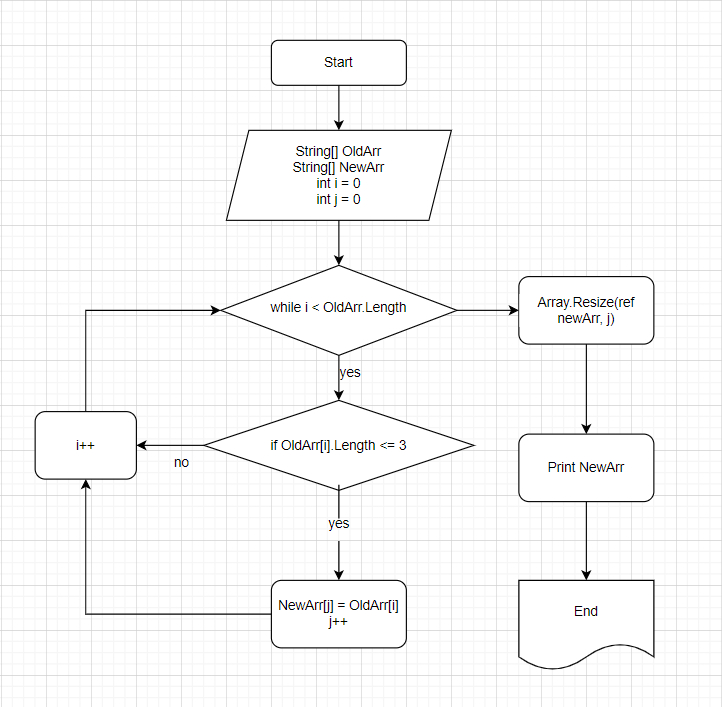

# Задача

Написать программу, которая из имеющегося массива строк формирует массив из строк, длинна которых меньше либо равна 3 символа. Первоначальный массив можно ввести с клавиатуры, либо задать на старте выполнения алгоритма. При решении не рекомендуется пользоваться коллекциями, лучше обойтись исключительно массивами.

## Блок-схема алгоритма

## Пошаговое описание

1. Пользователь вводит длинну массива;
2. Проверка, что введенное число больше 0;
3. Если число меньше или равно 0, выводится сообщение об ошибке;
4. Если Число больше 0, то создается 2 массива: первый заполняет пользователь, второй будет заполнятся в соответствии с условиями задачи;
5. Пользователь поочередно вводит значения каждого эллемента массива;
6. Заданный массив выводится на консоль;
7. Через цикл while (i < length) поочередно проверяется каждый эллемент массива на соответствие количества символов (<=3), начиная с i = 0, и увеличивая i++ после каждой проверки;
8. Если элемент соответствует условиям, то он присваивается новому массиву на место эллемента с индексом j = 0. Индекс нового массива увеличивается только в случае присваивания нового значения элементу с текущим индексом;
9. Когда все элементы старого массива проверены, в новом массиве отсекаются пустые значения.
10. Новый массив выводится в консоль.

**Выполнил** Крюков А.В.
